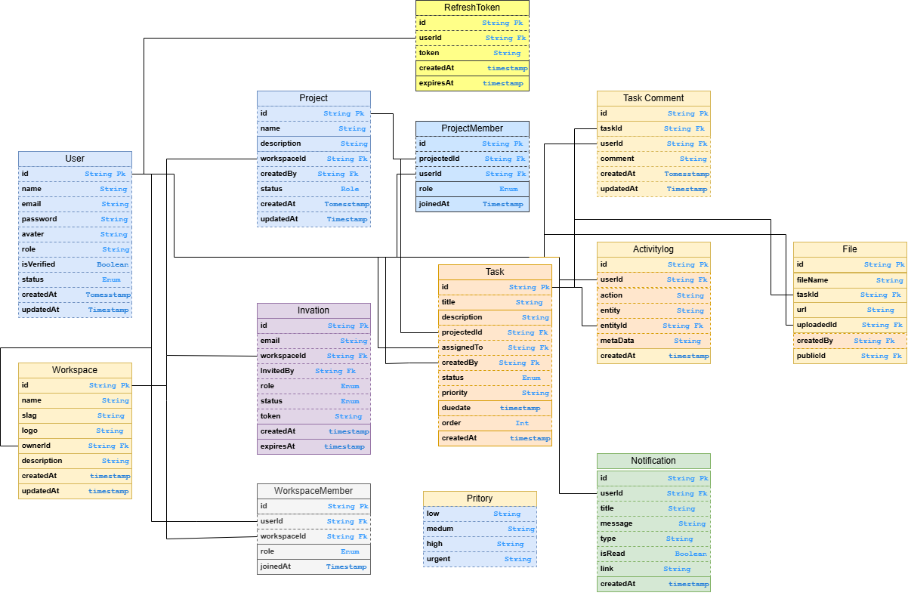

# FlowDesk - Database Design

## Entity Relationship Diagram

> This diagram represents the database architecture of the FlowDesk SaaS application.

---

# Database Entities

## 1. User

Stores all registered users.

### Fields

- id
- name
- email
- password
- avatar
- role
- status
- isVerified
- createdAt
- updatedAt

---

## 2. Workspace

A workspace is owned by a user and contains projects.

### Fields

- id
- name
- slug
- logo
- description
- ownerId
- createdAt
- updatedAt

---

## 3. WorkspaceMember

Stores all members of a workspace.

### Fields

- id
- workspaceId
- userId
- role
- joinedAt

---

## 4. Invitation

Stores pending workspace invitations.

### Fields

- id
- workspaceId
- email
- invitedBy
- role
- token
- status
- expiresAt
- createdAt

---

## 5. Project

A workspace can contain multiple projects.

### Fields

- id
- workspaceId
- name
- description
- status
- createdBy
- createdAt
- updatedAt

---

## 6. ProjectMember

Stores project members.

### Fields

- id
- projectId
- userId
- role
- joinedAt

---

## 7. Task

Stores all project tasks.

### Fields

- id
- projectId
- title
- description
- assignedTo
- createdBy
- priority
- status
- dueDate
- order
- createdAt
- updatedAt

---

## 8. TaskComment

Stores comments for a task.

### Fields

- id
- taskId
- userId
- comment
- createdAt
- updatedAt

---

## 9. Notification

Stores user notifications.

### Fields

- id
- userId
- title
- message
- type
- isRead
- link
- createdAt

---

## 10. ActivityLog

Stores every important activity performed by users.

### Fields

- id
- userId
- action
- entity
- entityId
- metadata
- createdAt

---

## 11. RefreshToken

Stores refresh tokens for authenticated users.

### Fields

- id
- userId
- token
- expiresAt
- createdAt

---

## 12. File

Stores uploaded task attachments.

### Fields

- id
- taskId
- fileName
- url
- publicId
- uploadedBy
- createdAt

---

# Relationships

- One User can own many Workspaces.
- One Workspace can have many Workspace Members.
- One Workspace can have many Projects.
- One Workspace can have many Invitations.
- One Project can have many Project Members.
- One Project can have many Tasks.
- One Task can have many Comments.
- One Task can have many Files.
- One User can receive many Notifications.
- One User can have many Refresh Tokens.
- One User can create many Activity Logs.

---

# Enumerations

## User Role

- SYSTEM_ADMIN
- USER

### Workspace Role

- OWNER
- ADMIN
- MEMBER
- GUEST

### Project Role

- PROJECT_ADMIN
- DEVELOPER
- VIEWER

### Project Status

- PLANNING
- ACTIVE
- COMPLETED
- ARCHIVED

### Task Status

- TODO
- IN_PROGRESS
- IN_REVIEW
- DONE

### Task Priority

- LOW
- MEDIUM
- HIGH
- URGENT

### Invitation Status

- PENDING
- ACCEPTED
- EXPIRED
- CANCELLED